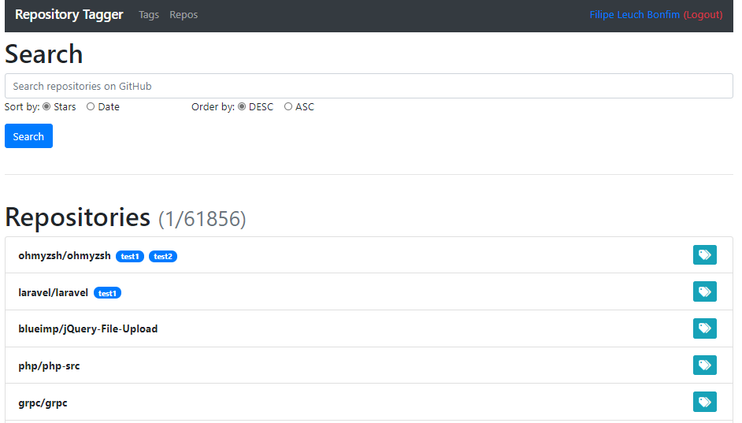

# Repository Tagger 🔍

Hi everyone, this simple project aims to search and tag repositories.

## About

With this first implementation, you can search and manage tags on GithHub repositories, loggin with diffent users and register new ones.

## Installation
```
git clone git@github.com:filipe1309/tag-repo.git
cd tag-repo
composer install
php artisan migrate
```

## Usage

### Tags & Repos

#### Search page


#### Tag page


#### Repositories page


## Authentication

### Login page


### Register page

